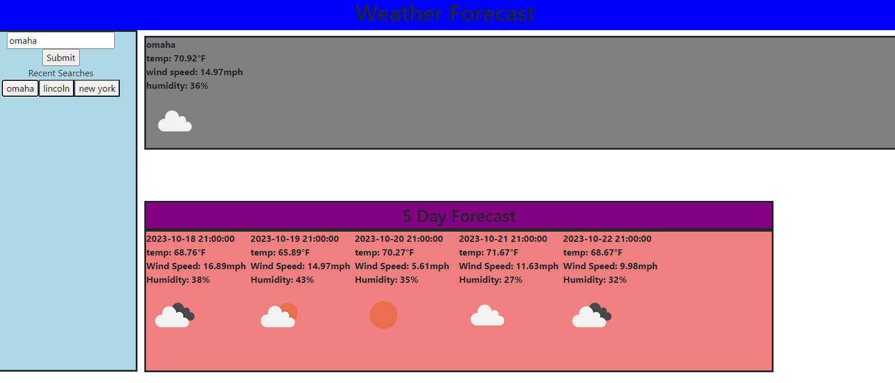

# Horiseon Refactor

## Description

In order to make planning vacations easier, this program was made to easily view the current weather conditions and forecasted weather of any city one might want to visit.

## Usage

Deployed Website: https://afontana405.github.io/Horiseon-Refactor/
## Credits

The starter code was sourced from Georgeyoo's github urban-octo-telegram repository which can be found below

Github Repo: https://github.com/coding-boot-camp/urban-octo-telegram

## License

Please refer to the LICENSE in the repo.
